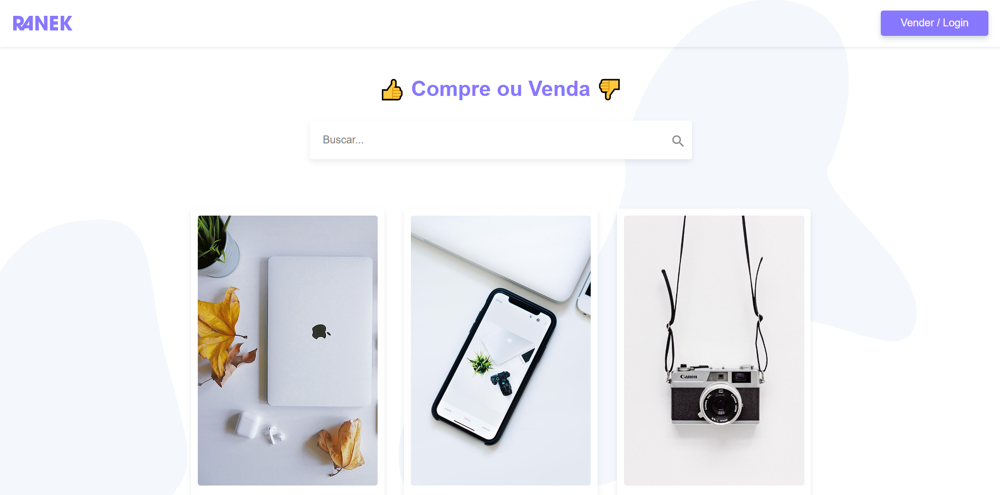

<p align="center">
  
</p>

<p align="center" fontSize="60px">
  Ranek
</p>

<p align="center">
  
</p>

<p align="center">
  
</p>
### Projeto

Desenvolver uma plataforma web para compra e venda de produtos.

### Funcionalidades

- [x] **Criar conta**: Criar conta na plataforma.

- [x] **Login**: Realizar login e logout na plataforma.

- [x] **Cadastrar produtos**: Cadastrar produtos para venda.

- [x] **Listar produtos**: Listar produtos disponíveis para compra.

- [x] **Listar meus produtos**: Listar meus produtos.

- [x] **Realizar compra e venda**: Realizar compra e venda de produtos.


### Conceitos abordados

- Consumo de api com o uso da lib [axios](https://github.com/axios/axios).

- Controle de rotas com [Vue Router](https://router.vuejs.org/).

- Controle de estudos e mutações das functions utilizando [Vue X](https://vuex.vuejs.org/).

- Uso de flexbox para alinhar e ajustar elementos na página.

## :rocket: Tecnologias

-  [Vue](https://vuejs.org/guide/introduction.html)
-  [Vue Router](https://router.vuejs.org/)
-  [Vue X](https://vuex.vuejs.org/)
-  [Axios](https://github.com/axios/axios)

## 📥 Instalação e execução

Faça um clone desse repositório e acesse o diretório.

```bash
$ git clone git@github.com:guilherme-studier/ranek.git && cd ranek
```

```bash
# Instalando as dependências
$ yarn

# Executanto aplicação
$ yarn serve

```

## :muscle: Contribuir ao projeto

Faça o `fork` e clone o projeto a partir do seu usuário.

```bash
# Clonando projeto
$ git clone https://github.com/SEU-NOME-DE-USUARIO/ranek.git

# Criando um branch
$ git branch minha-alteracao

# Acessando o novo branch
$ git checkout -b minha-alteracao

# Adicionando os arquivos alterados
$ git add .

# Criando commit e a mensagem
$ git commit -m "descrição da correção...."

# Enviando alterações para o brach
$ git push origin minha-alteracao
```
Você deve navegar até o seu repositório onde fez o fork e clicar no botão *New pull request* no lado esquerdo da página.

